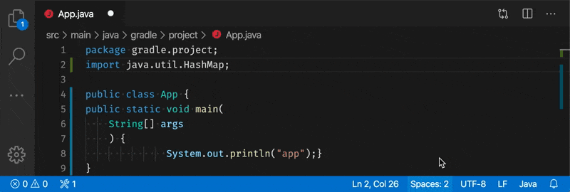

# Spotless Gradle

[](https://marketplace.visualstudio.com/items?itemName=richardwillis.vscode-spotless-gradle)
[](https://marketplace.visualstudio.com/items?itemName=richardwillis.vscode-spotless-gradle)
[](https://github.com/badsyntax/vscode-spotless-gradle/actions?query=workflow%3A"Build+%26+Publish")
[](https://github.com/badsyntax/vscode-spotless-gradle/actions?query=workflow%3ACodeQL)
[](https://github.com/badsyntax/vscode-spotless-gradle/issues?q=is%3Aissue+is%3Aopen+label%3Abug)

A VS Code extension to lint & format your code using [Spotless](https://github.com/diffplug/spotless) (via Gradle).



## Features

- Provides diagnostics to show invalid formatting (with quick fixes)
- Provides a Spotless fixAll code action (`Format on Save`)
- Provides a Spotless formatter (`Format Document`)

Supports all languages that Spotless supports.

## Requirements

- [VS Code >= 1.45.0](https://code.visualstudio.com/download)
- [Gradle for Java Extension >= 3.5.2](https://marketplace.visualstudio.com/items?itemName=vscjava.vscode-gradle)
- [Spotless Gradle Plugin >= 3.30.0](https://github.com/diffplug/spotless/tree/main/plugin-gradle)
- [Java >= 8](https://adoptopenjdk.net/)

## Usage

Before using this extension, ensure you've [configured Spotless](https://github.com/diffplug/spotless/tree/main/plugin-gradle) correctly in your Gradle build file. (Run `./gradlew spotlessDiagnose` to prepare & validate Spotless.)

### Enabling Spotless

Spotless formatting & diagnostics are _disabled by default_. Change the settings to adjust this behaviour:

```json
{
  "[java]": {
    "spotlessGradle.format.enable": true,
    "spotlessGradle.diagnostics.enable": true
  }
}
```

#### Format on Save

```json
{
  "[java]": {
    "editor.codeActionsOnSave": {
      "source.fixAll.spotlessGradle": true
    }
  }
}
```

#### Format Document

If there are multiple formatters for a language type, set Spotless to be the default:

```json
{
  "[java]": {
    "editor.defaultFormatter": "richardwillis.vscode-spotless-gradle"
  }
}
```

### Other Optional Settings

Disable other formatters to improve the performance, for example:

```json
{
  "[java]": {
    "files.trimTrailingWhitespace": false
  }
}
```

## How it Works

This extension runs the `spotlessApply` Gradle task on the focused file using the Spotless [IDE hook](https://github.com/diffplug/spotless/blob/main/plugin-gradle/IDE_HOOK.md) feature. Untitled/Unsaved files are ignored.

The vscode => Spotless interface is provided by the [Gradle Tasks](https://marketplace.visualstudio.com/items?itemName=vscjava.vscode-gradle) extension.

👉 [Architecture Overview](./ARCHITECTURE.md)

## Troubleshooting

View logs by selecting `Spotless Gradle` and/or `Gradle Tasks` in the output panel.

## Support

- 👉 [Submit a bug report](https://github.com/badsyntax/vscode-spotless-gradle/issues/new?assignees=badsyntax&labels=bug&template=bug_report.md&title=)
- 👉 [Submit a feature request](https://github.com/badsyntax/vscode-spotless-gradle/issues/new?assignees=badsyntax&labels=enhancement&template=feature_request.md&title=)

## Credits

- Thanks to [Ned Twigg](https://github.com/nedtwigg) for adapting Spotless for better IDE integration
- Thanks to all the [Spotless contributors](https://github.com/diffplug/spotless#acknowledgements)

## Release Notes

See [CHANGELOG.md](./CHANGELOG.md).

## License

See [LICENSE.md](./LICENSE.md).
