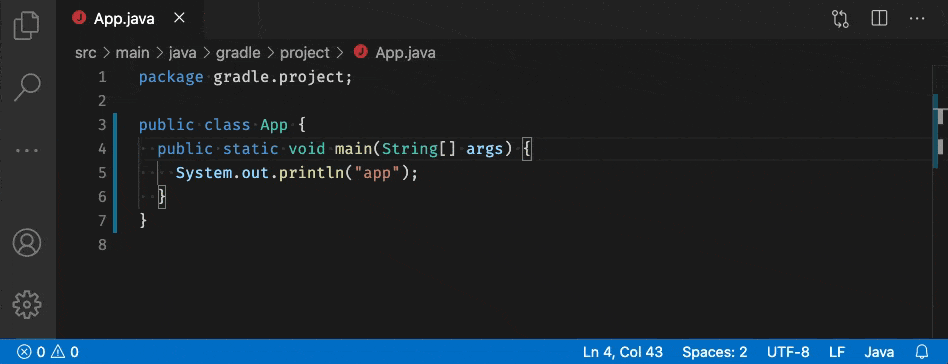

# Spotless Gradle

[](https://marketplace.visualstudio.com/items?itemName=richardwillis.vscode-spotless-gradle)
[](https://marketplace.visualstudio.com/items?itemName=richardwillis.vscode-spotless-gradle)
[](https://github.com/badsyntax/vscode-spotless-gradle/actions?query=workflow%3A"Build+%26+Publish")
[](https://github.com/badsyntax/vscode-spotless-gradle/actions?query=workflow%3ACodeQL)
[](https://github.com/badsyntax/vscode-spotless-gradle/issues?q=is%3Aissue+is%3Aopen+label%3Abug)

A VS Code extension to lint & format your code using [Spotless](https://github.com/diffplug/spotless) (via Gradle).



## Features

- Provides diagnostics to show invalid formatting (with quick fixes)
- Provides a Spotless fixAll code action (`Format on Save`)
- Provides a Spotless formatter (`Format Document`)

Supports `java`, `kotlin`, `kotlinscript`, `scala`, `sql`, `groovy`, `javascript`, `javascriptreact`, `typescript`, `typescriptreact`, `css`, `scss`, `less`, `vue`, `graphql`, `json`, `yaml`, `markdown`, `python`, `c`, `cpp`, `csharp`, `objective-c`, `objective-cpp` language types.

## Requirements

- [VS Code >= 1.45.0](https://code.visualstudio.com/download)
- [Gradle Tasks](https://marketplace.visualstudio.com/items?itemName=richardwillis.vscode-gradle)
- [Spotless Gradle Plugin >= 3.30.0](https://github.com/diffplug/spotless/tree/master/plugin-gradle)
- [Java >= 8](https://adoptopenjdk.net/)

For `scala`, `kotlin`, `kotlinscript`, `vue` & `graphql` languages, you'll need to install a language extension that provides these language identifiers.

## Usage

Before using this extension ensure you've [configured Spotless](https://github.com/diffplug/spotless/tree/master/plugin-gradle) correctly in your Gradle build file.

### Diagnostics

Diagnostics are reported by generating a diff from the `spotlessApply` result.

Quick fixes can be used to fix separate parts of the document.

### Formatting

As Spotless will format the entire document there's no reason to enable other formatters. Disable other formatters to improve the formatting performance, for example:

```json
"[java]": {
  "files.trimTrailingWhitespace": false
}
```

#### Format on Save

Enable Spotless fixes on file save in `settings.json`:

```json
"[java]": {
  "editor.codeActionsOnSave": {
    "source.fixAll.spotlessGradle": true
  }
}
```

#### Format Document

The `Format Document` feature can be accessed via the vscode `Command Palette`.

If there are multiple formatters for a language type, set Spotless to be the default in `settings.json`:

```json
"[java]": {
  "editor.defaultFormatter": "richardwillis.vscode-spotless-gradle"
}
```

## How it Works

This extension runs the `spotlessApply` Gradle task on the focused file. Untitled/Unsaved files are ignored.

Invoking the Spotless formatting will take a while if your Gradle build hasn't previously resolved project dependencies. To warm up Spotless, run `./gradlew spotlessDiagnose`.

The vscode => Spotless interface is provided by the [Gradle Tasks](https://marketplace.visualstudio.com/items?itemName=richardwillis.vscode-gradle) extension.

👉 [Architecture Overview](./ARCHITECTURE.md)

## Troubleshooting

View logs by selecting `Spotless Gradle` and/or `Gradle Tasks` in the output panel.

## Support

For general support queries, use the [#gradle-tasks](https://vscode-dev-community.slack.com/archives/C011NUFTHLM) channel in the [slack development community workspace](https://aka.ms/vscode-dev-community), or

- 👉 [Submit a bug report](https://github.com/badsyntax/vscode-spotless-gradle/issues/new?assignees=badsyntax&labels=bug&template=bug_report.md&title=)
- 👉 [Submit a feature request](https://github.com/badsyntax/vscode-spotless-gradle/issues/new?assignees=badsyntax&labels=enhancement&template=feature_request.md&title=)

## Credits

- Thanks to [Ned Twigg](https://github.com/nedtwigg) for adapting Spotless for better IDE integration
- Thanks to all the [Spotless contributors](https://github.com/diffplug/spotless#acknowledgements)

## Release Notes

See [CHANGELOG.md](./CHANGELOG.md).

## License

See [LICENSE.md](./LICENSE.md).
